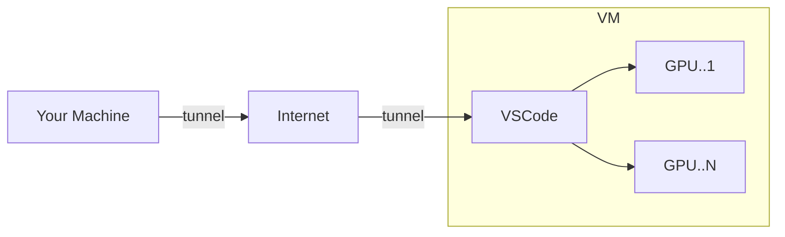

# vscode-gpus

A VSCode server hosted in the Cloud, backed with optional GPUs for accelerated 
ML training and experimentation.

## Use Case

You are a data scientist that wants to train/fine tune a complex Neural
Network. Your hardware is not powerful enough and whilst you've heard great
things about GPUs, you cannot afford or justify buying one.

`vscode-gpus` solves this issue by running an instance of the popular VSCode IDE on
VMs hosted in the cloud. Now you have the power to attach and unattach GPUs at
will for a fraction of the cost compared to buying one.

### How Does It Work?

VSCode introduced a feature that allows you to access VSCode [instances running
on remote servers][vscode-remote-tunnel]. This project uses this feature to
create a VM that is hosted on Google Cloud Platform that you can connect to. 

You simply configure the VM's vCPU and GPU count to match your workload. The VM has
batteries-included software that enables you to stay focussed on completing data 
science without having to worry about underlying software packages, versions and so 
on.

### How Do I Use It?

1. [Build the VM][build-vm].
2. [Run the VM][run-vm].
3. Access the instance in your browser via https://vscode.dev/tunnel/vscode-gpus.
4. When you are finished with the instance **and your source code is pushed**,
   run `$ make clean` to destroy VSCode and stop getting billed.

[vscode-remote-tunnel]: https://code.visualstudio.com/docs/remote/tunnels
[eda]: https://en.wikipedia.org/wiki/Exploratory_data_analysis
[build-vm]: ./docs/how-to/build-the-vm.md
[run-vm]: ./docs/how-to/run-the-vm.md
